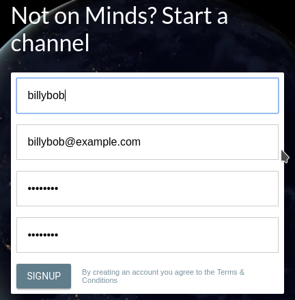

<title>Minds Guide</title>

# Minds Guide

## Intro

### Minds Introduction
Minds is a soical network that allows anyone to be heard with out being censored.

### Censorship
Other social networks like Facebook and Twitter censor unpopular ideas. In late 2016, Facebook anounced that it would be removing or marking what it calls "Fake News". "Fake News" in Facebook's eyes is any news that it doesn't agree with. This doesn't affect the mainstream media however, even though they create fake news all the time.

### History
Minds was founded by Bill Ottman, John Ottman and Mark Harding in 2012, and launched to the public in June 2015.
  
### Developers
  
#### Bill Ottman
Bill Ottman is the CEO and co-founder of Minds.

#### John Ottman
Bill Ottman is the co-founder of Minds.
  
#### Mark Harding
Mark Harding is the main developer for Minds.
  
## Getting Started

### Signing Up

#### Step 1
Go to https://www.minds.com

#### Step 2
Fill out the sign up form

  
### Layout

#### Newsfeed

#### Notifications

#### Wallet

#### Channel

### Posting

### Engagement

#### Liking

#### Disliking

#### Commenting

#### Reminding

#### Subscribing

## Profile

### Avatar

### Banner

### Bio

### Gender

### Birthdate
